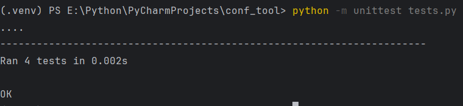

# Configuration Language Compiler

## 1. Общее описание

Этот проект представляет собой инструмент командной строки, который компилирует учебный конфигурационный язык в формат JSON. Инструмент поддерживает различные конструкции, такие как:
- Объявление констант (числа, строки, массивы).
- Вычисление выражений в постфиксной записи.
- Поддержка вложенных массивов.
- Отчет о синтаксических ошибках.

### Основные возможности:
- Чтение конфигурационного файла и его преобразование в JSON.
- Вычисление арифметических выражений с поддержкой операций сложения, вычитания, умножения и возведения в степень.
- Поддержка однострочных комментариев, строк, чисел и массивов с вложенными структурами.

## 2. Описание всех функций и настроек

### Основные функции:

### `ConfigParser`
Этот класс отвечает за парсинг конфигурационного файла и вычисление выражений.

- **Методы:**

  - `__init__(self)`: Инициализация класса, создает пустые словари для хранения констант и результата.
  
  - `parse(self, content)`: Основной метод парсинга. Принимает текстовое содержимое конфигурации, парсит строки и сохраняет результат в формате JSON.
  
  - `parse_constant(self, line)`: Парсинг строк для объявления констант. Поддерживаются целые и вещественные числа, строки и массивы.

  - `parse_array(self, value)`: Обрабатывает массивы, поддерживает вложенные массивы и различные типы данных внутри массива (числа, строки).

  - `evaluate_expression(self, line)`: Вычисляет постфиксные выражения. Поддерживаются арифметические операции: `+`, `-`, `*`, `pow()`.

### Настройки:
- `input_file`: Путь к файлу с конфигурацией, который необходимо передать через командную строку.

## 3. Описание команд для сборки проекта

### Установка зависимостей
Перед началом работы необходимо создать виртуальное окружение и установить зависимости.

### Запуск компилятора:
Для компиляции файла конфигурации запустите команду:

```bash
python main.py path/to/config.txt
```

### Пример:
```bash
python main.py config.txt
```

Этот файл будет преобразован в JSON, и результат будет выведен на экран.

## 4. Примеры использования

### Пример использования в командной строке

**Конфигурация веб-сервера**:

```
// Конфигурация веб-сервера
port is 8080;
host is "localhost";
allowed_ips is [ "192.168.1.1"; "192.168.1.2" ];
```

**Результат**:

```json
{
    "port": 8080,
    "host": "localhost",
    "allowed_ips": [
        "192.168.1.1",
        "192.168.1.2"
    ]
}
```
## 5. Результаты прогона тестов

Для запуска тестов используется библиотека `unittest`.

1. Запуск тестов:
   ```bash
   python -m unittest discover
   ```

2. Пример успешного прогона тестов:



Тесты покрывают следующие сценарии:
- Объявление констант с различными типами данных.
- Вычисление постфиксных выражений.
- Обработка ошибок синтаксиса.
- Поддержка вложенных массивов.
